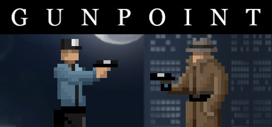

Traduction en Français pour le jeu Gunpoint

### Table des matières
**[Disclaimer](#disclaimer)** 
**[Installation](#installation)** 
**[Désinstallation](#d%C3%A9sinstallation)** 

## Disclaimer:
Vu que le patch initial a été perdu et que tous ceux ayant promis de le faire sur steam n'ont pas donné de nouvelle je me lance dans une traduction express.
Cette traduction a été effectuée avec une IA et pas encore testé, je ne sais pas si j'aurais le temps de le faire donc n'hésitez pas a faire les retour qui vous semble necessaire.
Tous les textes ne sont pas traduisables, uniquement les conversations sur le PDA (qui représente tout de même un bon 80% des dialogues du Jeu)
Evidement les tournure de phrases sont celle d'un traducteur et donc pas toujours naturelles, n'hésitez pas à améliorer si le coeur vous en dit.

Les accents et certains autres caractères spéciaux apparaissent dans les dialogues sous la forme de « % ». Je n'ai donc pas eu d'autre choix que de les omettre.

## Installation:
1) Téléchargez le dossier avec les scripts traduits
2) Remplacez le dossier à l'intérieur du fichier compressé à l'intérieur du dossier où vous avez installé le jeu ( X:\SteamLibrary\steamapps\common\Gunpoint ).

C'est fait ! Vous pourrez désormais voir les conversations de vos clients en Français.

## Désinstallation:
1) Supprimer le dossier ...steamapps\common\Gunpoint\Scripts
2) Clic droit sur le jeu dans steam / Propriétés / Fichiers installés / Vérifier l'intégrité des fichiers du jeu

## Télécharger la dernière version

